# Blog

Blog系统前端，一个简单的博客系统前端。有文章管理，单聊功能，群聊功能以及评论功能

[![Contributors][contributors-shield]][contributors-url]
[![Forks][forks-shield]][forks-url]
[![Stargazers][stars-shield]][stars-url]
[![Issues][issues-shield]][issues-url]


<!-- PROJECT LOGO -->
<br />

<p align="center">
  <a href="https://github.com/Cookici/blog/">
    
  </a>

<h3 align="center">Blog</h3>
  <p align="center">
    Blog后端系统
    <br />
    <a href="https://github.com/Cookici/blog"><strong>Blog前端项目文档 »</strong></a>
    <br />
    <br />
    <a href="https://github.com/Cookici/blog">查看Demo</a>
    ·
    <a href="https://github.com/Cookici/blog/issues">报告Bug</a>
    ·
    <a href="https://github.com/Cookici/blog/issues">提出新特性</a>
  </p>
</p>

本篇README.md面向开发者


<br /><br />

## 目录

- [上手指南](#上手指南)
    - [开发前的配置要求](#开发前的配置要求)
    - [部署步骤](#部署步骤)
- [文件目录说明](#文件目录说明)
- [开发的架构](#开发的架构)
- [部署](#部署)
- [使用到的框架](#使用到的框架)
- [贡献者](#贡献者)
    - [如何参与开源项目](#如何参与开源项目)
- [版本控制](#版本控制)
- [作者](#作者)
- [项目参考以及鸣谢](#项目参考以及鸣谢)
- [项目已知问题](#项目已知问题)
- [Blog后端项目](#Blog后端项目)
- [项目展示](#项目展示)


<br /><br />

### 上手指南
    需要一定的硬件配置以及编程基础


###### 开发前的环境配置
1. IDEA
2. Node.js v18.18.2
3. npm 10.2.1


###### **搭建步骤**
1. Vite搭建Vue+TypeScript环境
2. 进入blog_vue根目录执行npm install下载所有所需的依赖


<br /><br />

### 文件目录说明

```
Blog
├── public
└── src
    ├── assets
    ├── components
    ├── models
    ├── router
    ├── stores
    ├── utils
    ├── view
    ├── App.vue
    ├── main.ts
    └── shims-vue.d.ts

```
由于个人写的很杂，所以将功能实现的使用到的组件列出来
1. 头像裁剪 vue-cropper
2. 聊天内容滚动 v3-scroll
3. 聊天消息触发滚动 vue3-eventbus
4. 聊天emoji vue3-emoji
5. 评论和锚点（存在bug）功能 undraw-ui
6. 富文本编辑功能（现在使用tinymce-vue之前是vue-quill）


<br /><br />

### 开发的架构
Vue3+Vite+TypeScript

<br /><br />


### 使用到的框架
- vue ^3.3.6
- vite ^4.0.0
- typescript ^5.2.2
- vue-router ^4.0.0
- vue3-eventbus ^2.0.0
- element-plus ^2.4.1
- pinia ^2.1.7
- axios ^1.5.1


<br /><br />

### 贡献者
当然只有我一个人咯😭😭😭


<br /><br />

#### 如何参与开源项目
贡献使开源社区成为一个学习、激励和创造的绝佳场所。你所作的任何贡献都是**非常感谢**的。


<br /><br />

### 版本控制
该项目使用Git进行版本管理。您可以在repository参看当前可用版本。

<br /><br />


### 作者
✉️632832232@qq.com
🐧632832232


<br /><br />

### 项目参考以及鸣谢
- 本项目中使用到的各种开源组件及框架的开发者们
- 本项目中参考开源社区的各位前辈的解决方案以及代码实现

<br /><br />


### 项目已知问题
个人前端语法结构不太好，所以项目有很多值得优化的地方
1. 个人TypeScript语法不够好，所以项目中有很多标红
2. 项目中有很多重复的方法，可考虑提取成公共的方法
3. 每个大组件中可抽取很多小组件，写得过于冗杂


<br /><br />

### Blog后端项目
<a href="https://github.com/Cookici/blog/tree/main">Blog</a>


<br /><br />

### 项目展示
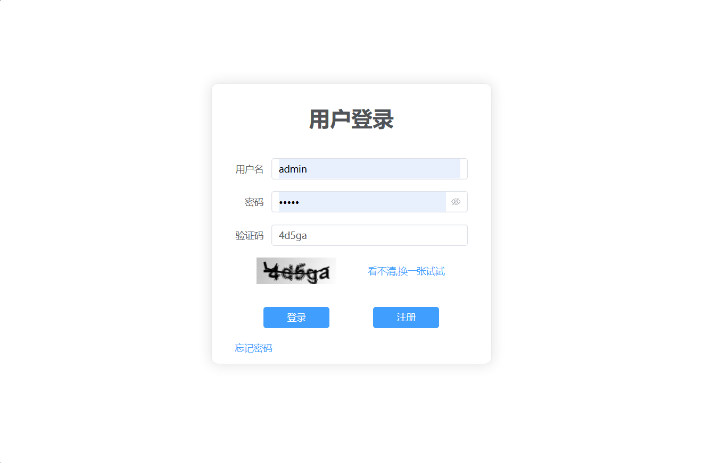
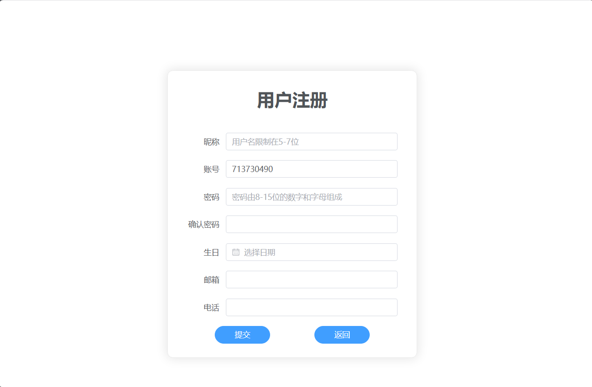
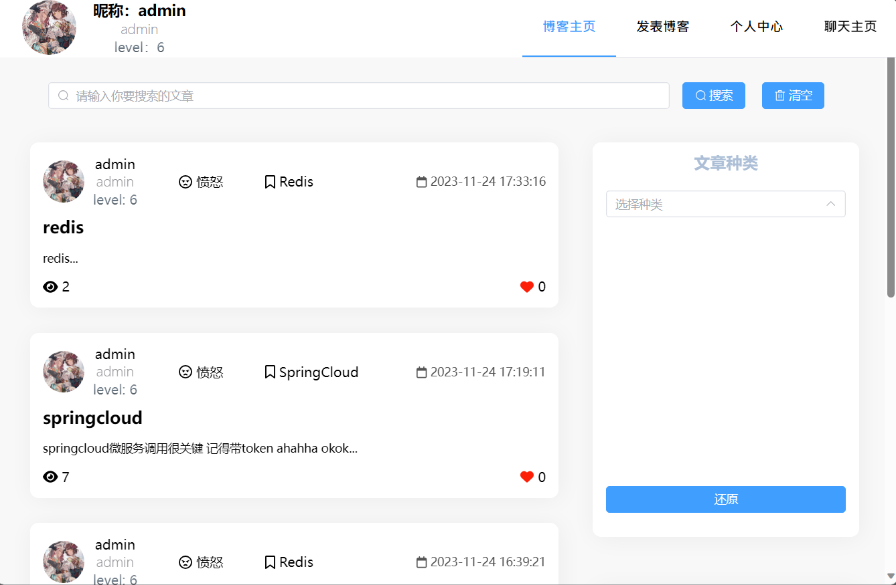
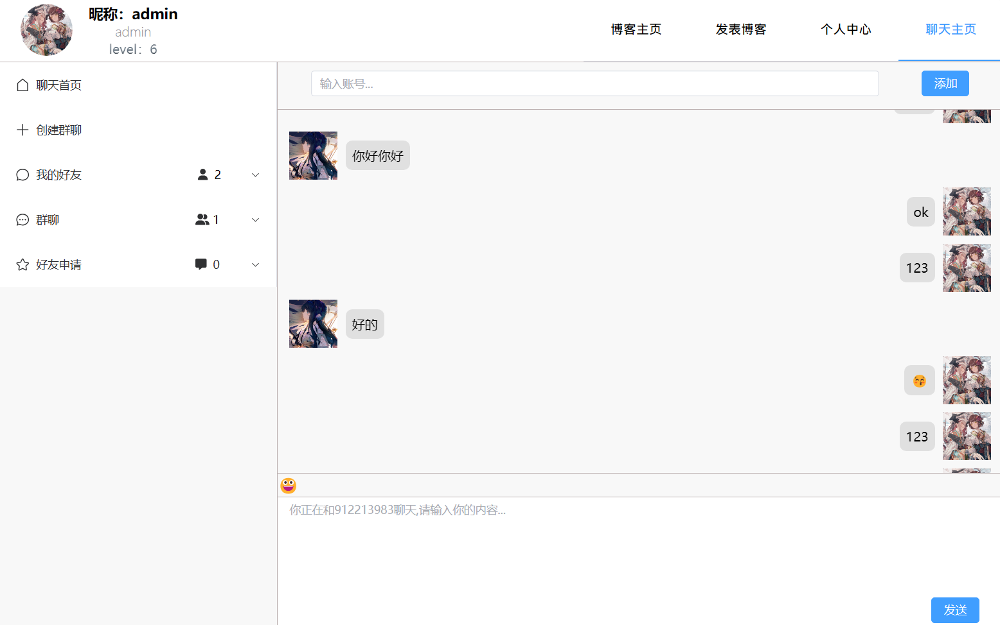
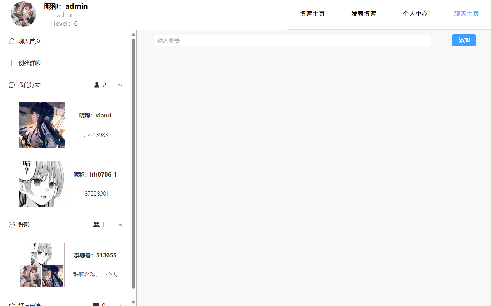
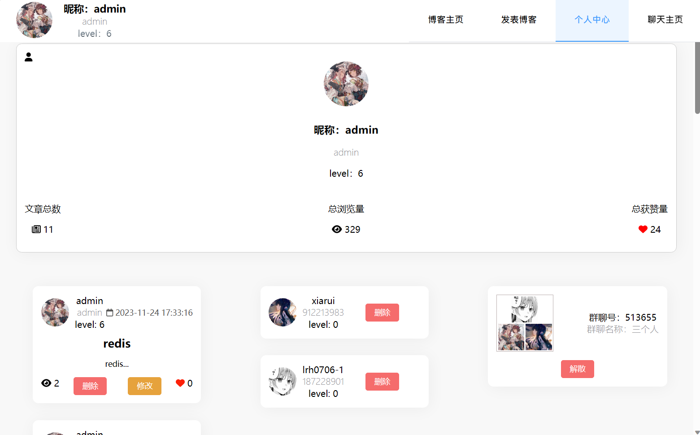
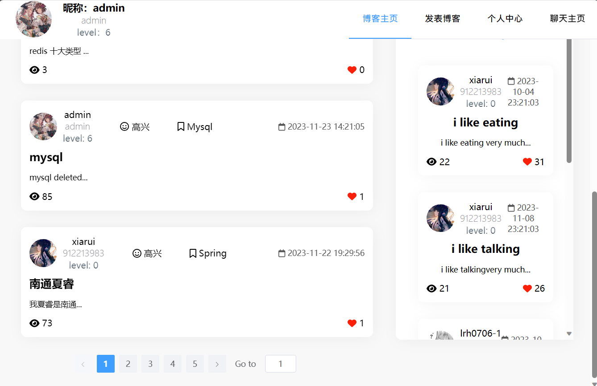
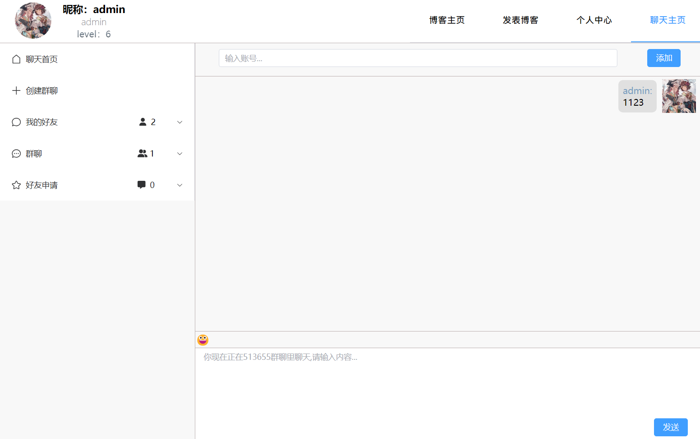
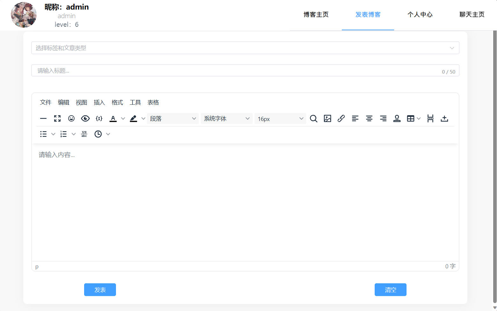
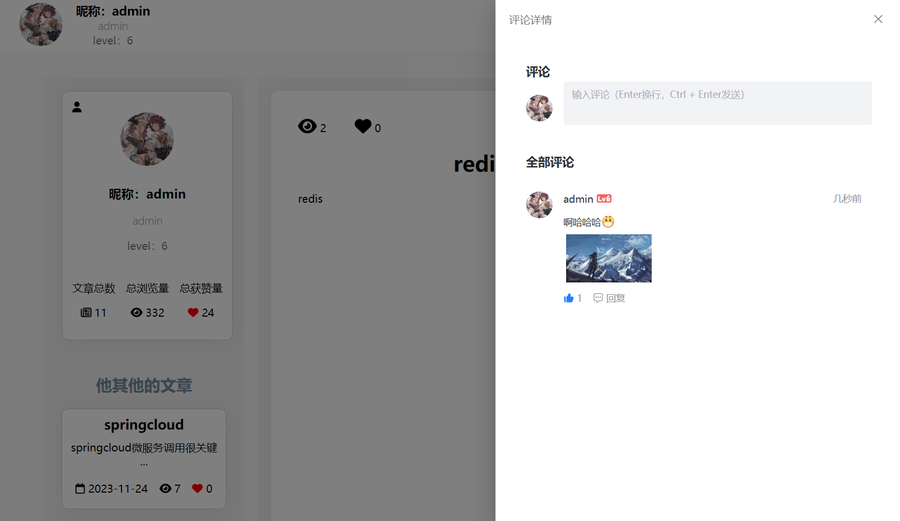
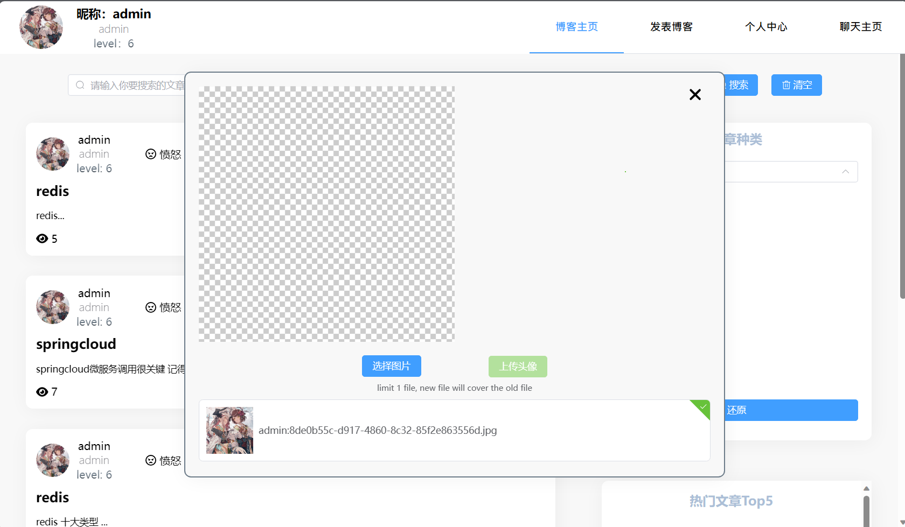


<!-- links -->

[your-project-path]: https://github.com/Cookici/blog/tree/main

[contributors-shield]: https://img.shields.io/github/contributors/Cookici/blog.svg?style=flat-square

[contributors-url]: https://github.com/Cookici/blog/graphs/contributors

[forks-shield]: https://img.shields.io/github/forks/Cookici/blog.svg?style=flat-square

[forks-url]: https://github.com/Cookici/blog/network/members

[stars-shield]: https://img.shields.io/github/stars/Cookici/blog.svg?style=flat-square

[stars-url]: https://github.com/Cookici/blog/stargazers

[issues-shield]: https://img.shields.io/github/issues/Cookici/blog.svg?style=flat-square

[issues-url]: https://img.shields.io/github/issues/Cookici/blog.svg

[license-shield]: https://img.shields.io/github/license/Cookici/blog.svg?style=flat-square

